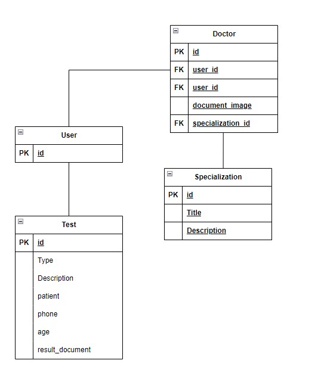

# Hospital System Django

## Project Setup

- Run `pip install -r requirements.txt`

- Create a .env file in the project root directory and name the following variables.

    1. DJANGO_SECRET
    2. DB_NAME = 'hospital'
    3. DB_USER = 'root'
    4. DB_PASSWORD='abhi123'

## Schema Design

